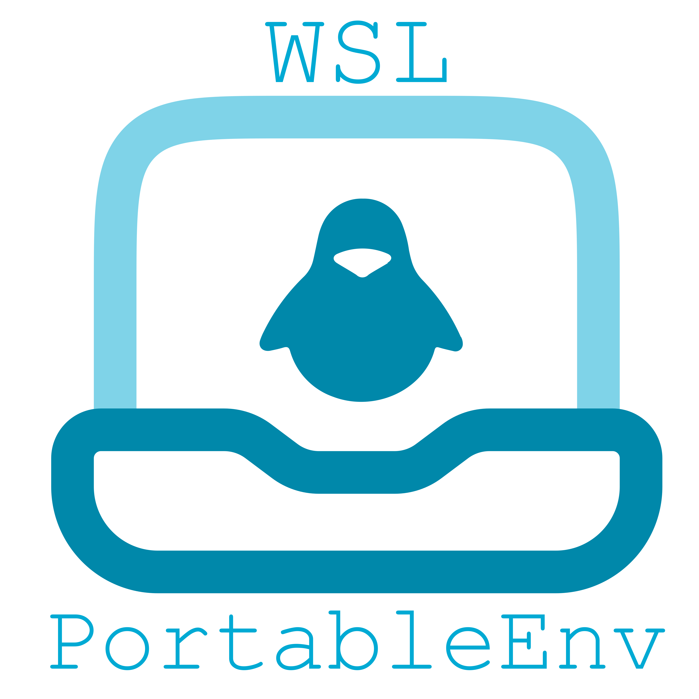
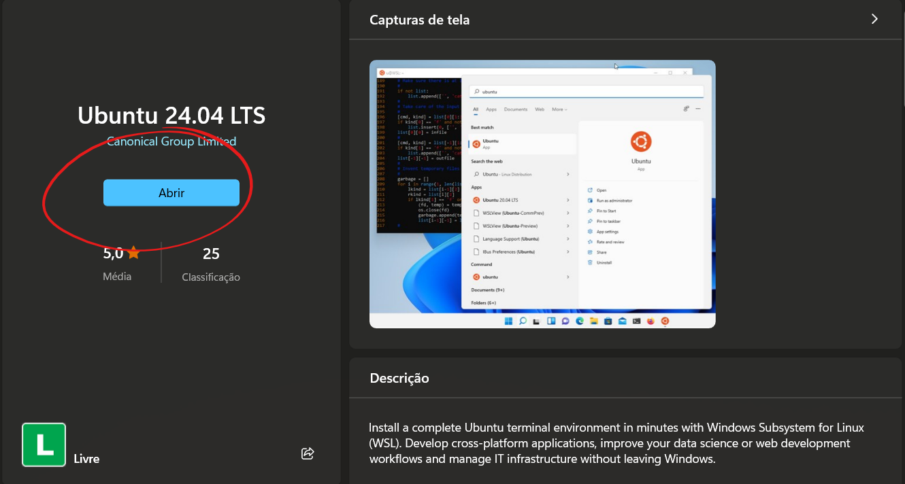
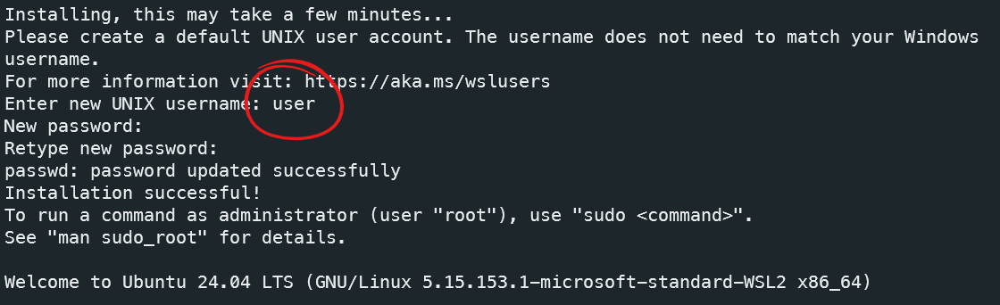
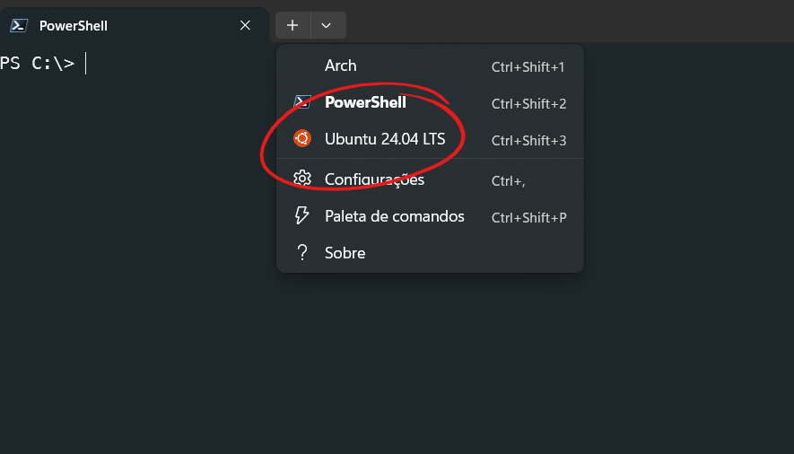
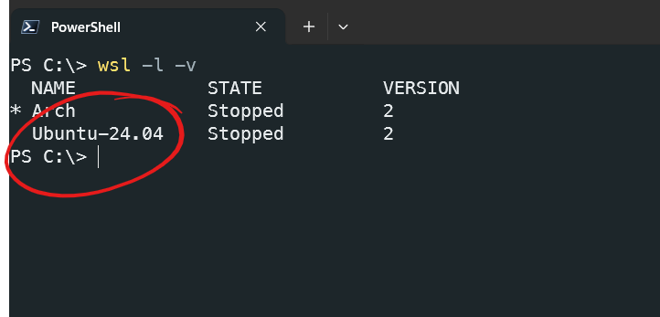

<p align="center">

</p>

[](#)
[](#)
[](./LICENSE)

Um ambiente de desenvolvimento Ubuntu portátil para estudantes e profissionais.

**WSL-PortableEnv** fornece orientações sobre como criar ambientes de desenvolvimento Ubuntu portáteis e customizados usando o Windows Subsystem for Linux (WSL). Ideal para ambientes acadêmicos e projetos específicos, permite que você configure ambientes dedicados para diferentes tipos de projetos, mantendo-os isolados e facilmente transferíveis entre máquinas.

# Índice

- [Recursos](#recursos)
- [Capturas de Tela](#capturas-de-tela)
- [Começando](#começando)
- [Pré-requisitos](#pré-requisitos)
- [Instalação](#instalação)
    - [Instalação do WSL e Ubuntu](#instalação-do-wsl-e-ubuntu)
- [Gerenciamento de Ambientes WSL](#gerenciamento-de-ambientes-wsl)
    - [Backup da Distribuição](#backup-da-distribuição)
    - [Desregistro (Remoção) da Distribuição](#desregistro-remocao-da-distribuicao)
    - [Importação para um Local Específico](#importacao-para-um-local-especifico)
- [Uso de Instâncias WSL Específicas para Projetos](#uso-de-instancias-wsl-especificas-para-projetos)
- [Criação de Templates de Ambientes WSL](#criacao-de-templates-de-ambientes-wsl)
- [Importação de Templates para Projetos](#importacao-de-templates-para-projetos)
- [Compatibilidade com Ubuntu Nativo](#compatibilidade-com-ubuntu-nativo)
- [Contribuindo](#contribuindo)
- [Licença](#licença)

# Recursos

- **Portabilidade**: Facilmente exporte e importe seus ambientes WSL Ubuntu.
- **Ambientes Customizados**: Crie instâncias WSL específicas para diferentes tipos de projetos.
- **Isolamento**: Mantenha ambientes de desenvolvimento separados para evitar conflitos de dependências.
- **Eficiência de Recursos**: Carregue apenas os componentes necessários para cada projeto.

# Capturas de Tela


*Figura 1: Ambiente Ubuntu gráfico dentro do Windows usando WSL-PortableEnv*

# Começando

## Pré-requisitos

- **Windows 10 versão 2004 ou superior** ou **Windows 11**
- **Windows Subsystem for Linux 2 (WSL 2)**
- **Conexão com a internet**

## Instalação

### Instalação do WSL e Ubuntu

1. **Habilitar o WSL e a Plataforma de Máquina Virtual**

Abra o PowerShell como administrador e execute:

```powershell
dism.exe /online /enable-feature /featurename:Microsoft-Windows-Subsystem-Linux /all /norestart
dism.exe /online /enable-feature /featurename:VirtualMachinePlatform /all /norestart
```

2. **Atualizar para o WSL 2**

Baixe e instale o pacote de atualização do kernel do Linux a partir do [link oficial da Microsoft](https://aka.ms/wsl2kernel).

Defina o WSL 2 como padrão:

```powershell
wsl --set-default-version 2
```

3. **Instalar o Ubuntu**

 - Pela Loja de Aplicativos da Microsoft

    Na Microsoft Store, procure por "Ubuntu" da versão desejada e instale a distribuição.

    *Após a instalação:*

    1. **Iniciar o Ubuntu:**

    Ao final, clique em **abrir** conforme a figura

    <p align="center">
    
    </p>

    Caso já tenha fechado a janela, procure pela distro no *Menu Iniciar*

    - Clique no botão **Iniciar** do Windows.
    - Procure por **Ubuntu** na lista de aplicativos instalados.
    - Clique em **Ubuntu** para abrir.

 - Instalação via linha de comando:*

    ```powershell
    wsl --install -d Ubuntu
    ```

    Após a instalação pela linha de comando, siga os mesmos passos acima para iniciar o Ubuntu e concluir a configuração inicial.

2. **Concluir a Configuração Inicial:**

- Na primeira execução, o Ubuntu finalizará a instalação.
- Você será solicitado a **criar um nome de usuário e senha** para o ambiente Linux.
    - **Nota:** Este nome de usuário e senha são específicos do ambiente Linux e não estão relacionados à sua conta do Windows.
- Siga as instruções na tela para concluir a configuração.

 <p align="center">
   
 </p>

Pode fechar a janela. Agora, da próxima vez que abrir o *Windows Terminal* AO selecionar um novo prompt, uma das opções será o Ubuntu recem instalado

 <p align="center">
   
 </p>


3. **Verificar a Instalação:**

- Abra o **PowerShell** ou **Prompt de Comando**.
- Execute o comando:

    ```powershell
    wsl -l -v
    ```

- Verifique se o **Ubuntu** aparece na lista de distribuições instaladas.

 <p align="center">
   
 </p>

**Próximos Passos:**

- **Prosseguir para a [Seção de Procedimentos Pós-Instalação](#procedimentos-pos-instalacao)** para continuar a configuração do seu ambiente.

**Nota:** A instalação padrão armazena os arquivos do WSL no diretório padrão do Windows.

## Gerenciamento de Ambientes WSL

Para personalizar o local de instalação ou criar instâncias específicas para projetos, siga os passos abaixo.

### Backup da Distribuição

Para criar um backup da sua distribuição Ubuntu existente:

```powershell
wsl --export Ubuntu ubuntu_backup.tar
```

- `Ubuntu` é o nome da sua distribuição (verifique com `wsl -l -v`).
- `ubuntu_backup.tar` é o nome do arquivo de backup que será criado.
### Desregistro (Remoção) da Distribuição

Para remover a distribuição do WSL (sem excluir o arquivo de backup):

```powershell
wsl --unregister Ubuntu
```

**Atenção:** Este comando remove a distribuição do WSL. Certifique-se de ter feito o backup antes.

### Importação para um Local Específico

Para importar a distribuição para um diretório específico:

```powershell
wsl --import UbuntuCustom D:WSLUbuntuCustom ubuntu_backup.tar --version 2
```

- `UbuntuCustom` é o novo nome da distribuição.
- `D:WSLUbuntuCustom` é o diretório onde a distribuição será instalada.
- `ubuntu_backup.tar` é o arquivo de backup criado anteriormente.

Agora, sua distribuição Ubuntu está instalada no local especificado.

## Uso de Instâncias WSL Específicas para Projetos

É possível criar instâncias WSL dedicadas para diferentes tipos de projetos, permitindo ambientes isolados e customizados.

### Criação de Templates de Ambientes WSL

1. **Configurar a Distribuição**

Instale e configure todas as ferramentas e dependências necessárias para o tipo de projeto desejado.

2. **Exportar a Distribuição como Template**

```powershell
wsl --export UbuntuCustom ubuntu_template.tar
```

- `UbuntuCustom` é o nome da distribuição configurada.
- `ubuntu_template.tar` é o arquivo que servirá como template.

### Importação de Templates para Projetos

Para criar um novo ambiente a partir do template:

```powershell
wsl --import ProjetoX D:WSLProjetoX ubuntu_template.tar --version 2
```

- `ProjetoX` é o nome da nova distribuição para o projeto específico.
- `D:WSLProjetoX` é o diretório onde será instalada.

Agora, você tem uma instância WSL configurada especificamente para o Projeto X.

**Benefícios:**

- **Isolamento de Ambientes:** Evita conflitos de dependências entre projetos.
- **Eficiência:** Carrega apenas os componentes necessários para cada projeto.
- **Facilidade de Gerenciamento:** Inicie, pare ou remova ambientes sem impactar outros projetos.

**Dicas:**

- **Automação:** Crie scripts para automatizar a criação e configuração dos ambientes.
- **Compartilhamento:** Distribua templates pré-configurados com sua equipe.

### Compatibilidade com Ubuntu Nativo

Os passos de configuração dentro do Ubuntu são compatíveis com instalações nativas. Isso garante que todos os usuários, independentemente do sistema operacional, possam seguir este guia e obter um ambiente consistente.

# Contribuindo

Contribuições são bem-vindas! Sinta-se à vontade para abrir issues e pull requests.

# Licença

Este projeto está licenciado sob a [Licença MIT](./LICENSE).

---

**Palavras-chave**: WSL, Ubuntu, Ambiente de Desenvolvimento, Portabilidade, WSL2, Templates, Isolamento de Ambientes, Windows Subsystem for Linux, Desenvolvimento Linux no Windows, Ambientes Customizados.
