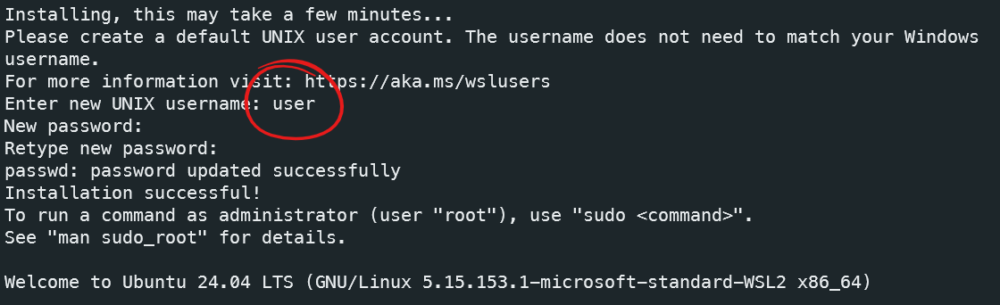

# Guia de Instalação

 

 ## Índice

 - [Pré-requisitos](#pré-requisitos)
 - [Instalação do WSL e Ubuntu](#instalação-do-wsl-e-ubuntu)
 - [Procedimentos Pós-Instalação](#procedimentos-pos-instalacao)
 - [Escolhendo o Local de Instalação](#escolhendo-o-local-de-instalação)
 - [Próximos Passos](#próximos-passos)

 ## Pré-requisitos

 - **Windows 10 versão 2004 ou superior** ou **Windows 11**
 - **Conexão com a internet**

 ## Instalação do WSL e Ubuntu

### Passo 1: Habilitar o WSL e a Plataforma de Máquina Virtual

 Abra o **PowerShell** como administrador e execute:

 ```powershell
 dism.exe /online /enable-feature /featurename:Microsoft-Windows-Subsystem-Linux /all /norestart
 dism.exe /online /enable-feature /featurename:VirtualMachinePlatform /all /norestart
 ```

### Passo 2: Atualizar para o WSL 2

 Baixe e instale o pacote de atualização do kernel do Linux a partir do [link oficial da Microsoft](https://aka.ms/wsl2kernel).

 Defina o WSL 2 como padrão:

 ```powershell
 wsl --set-default-version 2
 ```

### Passo 3: Instalar o Ubuntu

- **Pela Loja de Aplicativos da Microsoft**

   Na **Microsoft Store**, procure por **"Ubuntu"** da versão desejada e instale a distribuição.

   *Após a instalação:*

   1. **Iniciar o Ubuntu:**

      Ao final, clique em **Abrir** conforme a figura:

       <p align="center">
        
       </p>

      Caso já tenha fechado a janela, procure pela distro no **Menu Iniciar**:

      - Clique no botão **Iniciar** do Windows.
      - Procure por **Ubuntu** na lista de aplicativos instalados.
      - Clique em **Ubuntu** para abrir.

- **Instalação via linha de comando:**

   ```powershell
   wsl --install -d Ubuntu
   ```

   Após a instalação pela linha de comando, siga os mesmos passos acima para iniciar o Ubuntu e concluir a configuração inicial.

### Passo 4: Concluir a Configuração Inicial

 - Na primeira execução, o Ubuntu finalizará a instalação.
 - Você será solicitado a **criar um nome de usuário e senha** para o ambiente Linux.
   - **Nota:** Este nome de usuário e senha são específicos do ambiente Linux e não estão relacionados à sua conta do Windows.
 - Siga as instruções na tela para concluir a configuração.

 <p align="center">
  
 </p>

 Pode fechar a janela. Agora, da próxima vez que abrir o **Windows Terminal**, ao selecionar um novo prompt, uma das opções será o Ubuntu recém-instalado.

 <p align="center">
  
 </p>

### Passo 5: Verificar a Instalação

 - Abra o **PowerShell** ou **Prompt de Comando**.
 - Execute o comando:

 ```powershell
 wsl -l -v
 ```

 - Verifique se o **Ubuntu** aparece na lista de distribuições instaladas.

 <p align="center">
  
 </p>

## Procedimentos Pós-Instalação

Consulte o [Procedimentos Pós-Instalação](./procedimentos-pos-instalacao.md) para configurar seu ambiente de desenvolvimento.

## Escolhendo o Local de Instalação

Por padrão, o WSL armazena os arquivos no diretório padrão do Windows. Se desejar instalar em um local específico, siga o guia de [Importação para um Local Específico](./importacao-local-especifico.md).

## Próximos Passos

- [Procedimentos Pós-Instalação](./procedimentos-pos-instalacao.md)
- [Uso de Templates](./uso-de-templates.md)
